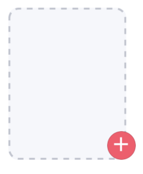
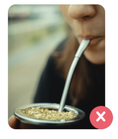

Tinder like add remove image component


No imageSource provided                          |  imageSource provided
:-----------------------------------------------:|:-----------------------------------------------:
 |  


## Usage

```js 
// src/AddRemove.tsx
import React, { useState } from 'react';
import { AddRemoveImage } from 'nottinderuikit';
import { MaterialCommunityIcons, Entypo } from '@expo/vector-icons';

const AddRemove = () => {
  const [imageSource, setImageSource] = useState<undefined | { uri: string }>()
  const removeIcon = <Entypo name='cross' size={25} color='white' />;
  const addIcon = (
    <MaterialCommunityIcons name='plus' size={25} color='white' />
  );
  const saveImage = (id: string) => {
    // Here you upload your image to your server
    // We just log the image id and set an imageSource 😄
    console.log(`Uploading image ${id}`);
    const uri = 'https://images.unsplash.com/photo-1585744134783-ae8804f900dc?ixlib=rb-1.2.1&ixid=eyJhcHBfaWQiOjEyMDd9&auto=format&fit=crop&w=933&q=80';
    setImageSource({ uri });
  }
  const removeImage = (id: string) => {
    // Here you delete your image from your server
    // We just log the image id and unset the imageSource
    console.log(`Removing image ${id}`);
    setImageSource(undefined);
  }
  const sampleId = 'Image-1';


  return <AddRemoveImage
    addIcon={addIcon}
    addImage={saveImage}
    removeIcon={removeIcon}
    removeImage={removeImage}
    imageSource={imageSource}
    id={sampleId}
  />
}

export default AddRemove
```


---

## Props

- [`id`](#id)
- [`addIcon`](#addicon)
- [`addCallback`](#addcallback)
- [`removeIcon`](#removeicon)
- [`removeCallback`](#removecallback)
- [`imageSource`](#imagesource)

---
## Reference

### `id`

Identifier of the file, this value is pased as a parameter on [addCallback](#addCallback) and [removeCallback](#removeCallback).

|  Type  | Default       | Required |
| :----: | :-----------: | :------: |
| string |   undefined   | true     |

---

### `addIcon`

> We didn't include icons as part of the library,
> in this example we used the ones provided by `@expo/vector-icons`

Icon shown on the bottom right of the component when there's no imageSource provided.

|  Type     | Default       | Required |
| :-------: | :-----------: | :------: |
| ReactNode |   undefined   | true     |

---
### `addCallback`

Function called when the component is pressed and there's no imageSource.

|  Type                           | Default       | Required |
| :-----------------------------: | :-----------: | :------: |
| function: ( id: string ) => any |   undefined   | true     |

---
### `removeIcon`

> We didn't include icons as part of the library,
> in this example we used the ones provided by `@expo/vector-icons`

Icon shown on the bottom right of the component when there is imageSource provided.

|  Type     | Default       | Required |
| :-------: | :-----------: | :------: |
| ReactNode |   undefined   | true     |

---
### `removeCallback`

Function called when the [removeIcon](#removeIcon) is pressed.

|  Type                           | Default       | Required |
| :-----------------------------: | :-----------: | :------: |
| function: ( id: string ) => any |   undefined   | true     |

---
---
### `imageSource`

Source object of the image

|  Type                   | Default       | Required |
| :---------------------: | :-----------: | :------: |
| object: { uri: string } |   undefined   | false    |

---
