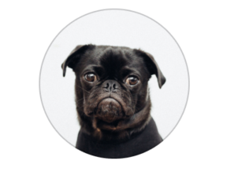

Simple rounded Avatar




## Usage

```js 
import React from 'react'
import { Avatar } from 'nottinderuikit'

const SimpleAvatar = () => {
  const uri = 'https://images.unsplash.com/photo-1537815749002-de6a533c64db?ixlib=rb-1.2.1&auto=format&fit=crop&w=1445&q=80';
  return <Avatar source={{ uri }} size={120} />
}

export default SimpleAvatar
```

---

## Props

- [`source`](#source)
- [`size`](#size)
- [`style`](#style)

---
## Reference


### `source`

Source object of the image

|  Type                   | Default       | Required |
| :---------------------: | :-----------: | :------: |
| object: { uri: string } |   undefined   |  true    |

---

### `size`

Size of the avatar, this value is going to be set as the height and width.

|  Type  | Default | Required |
| :----: | :-----: | :------: |
| number |   60    | false    |


---

### `style`

Add aditional styles to the component.

|  Type  | Default        | Required |
| :----: | :------------: | :------: |
| object |   undefined    | false    |


---

