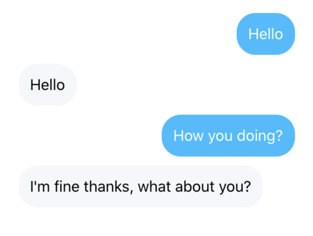

ChatBubble




## Usage

```js 
import React from 'react'
import { View } from 'react-native'
import { ChatBubble } from 'nottinderuikit'

const ChatSample = () => {

  return <View style={{ width: "80%", paddingHorizontal: 20 }}>
              <ChatBubble
                text="Hello"
                id="1223"
              />
              <ChatBubble
                text="Hello"
                id="1224"
                isInbound
              />
              <ChatBubble
                text="How you doing?"
                id="1225"
              />
              <ChatBubble
                text="I'm fine thanks, what about you?"
                id="1226"
                isInbound
              />
          </View>
}

export default ChatSample
```

---

## Props

- [`id`](#id)
- [`text`](#text)
- [`isInbound`](#isinbound)

---
## Reference


### `id`

Message id

|  Type     | Default       | Required |
| :-------: | :-----------: | :------: |
| string    |   undefined   |  true   |

---
### `text`

Text to be displayed

|  Type     | Default       | Required |
| :-------: | :-----------: | :------: |
| string    |   undefined   |  true    |

---
### `isInbound`

The components we want to wrap into the Card

|  Type     | Default       | Required |
| :-------: | :-----------: | :------: |
| boolean   |   undefined   |  false   |
