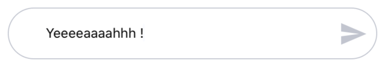

A tinder like chat input 




## Usage

```js 
import React, { useState } from 'react';
import { MaterialIcons } from '@expo/vector-icons'
import { colors, ChatInput } from 'nottinderuikit'
const SimpleChatInput = () => {
  const [value, setValue] = useState('');
  const sendIcon = <MaterialIcons name='send' size={30} color={colors.darkGrey} />;
  const handleSend = () => {
    console.log(value);
    setValue('');
  }

  return <ChatInput
    value={value}
    handleChangeText={setValue}
    handleSend={handleSend}
    sendIcon={sendIcon}
  />
}

export default SimpleChatInput;
```

---

## Props

- [`value`](#value)
- [`handleChangeText`](#handlechangetext)
- [`handleSend`](#handlesend)
- [`sendIcon`](#sendicon)

---
## Reference


### `value`

Value of the input.

|  Type     | Default       | Required |
| :-------: | :-----------: | :------: |
| string    |   undefined   |  true    |

---
### `handleChangeText`

Function called when the text on the input changes.

|  Type                                    | Default       | Required |
| :--------------------------------------: | :-----------: | :------: |
| function: (nextValue: string) => void    |   undefined   |  true    |

---
### `handleSend`

Function called when send is pressed.

|  Type                 | Default       | Required |
| :-------------------: | :-----------: | :------: |
| function: ()=> void   |   undefined   |  false   |

---
### `sendIcon`

Send message icon.

|  Type      | Default              | Required |
| :--------: | :------------------: | :------: |
| ReactNode  |   <Text>Send<Text>   |  false   |
