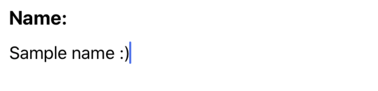
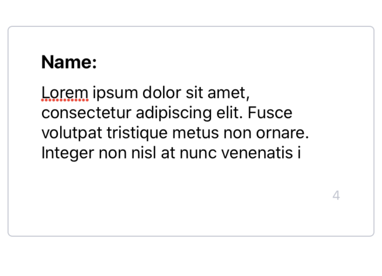

Simple input with it's label

## Usage

### Single line:



```js 
import React, { useState } from 'react';
import LabeledInput from './LabeledInput';

const SampleLabeledInput = () => {
  const [value, setValue] = useState("");
  return <LabeledInput
    label='Name:'
    value={value}
    onTextChange={setValue}
  />

}

export default SampleLabeledInput
```

### MultiLine:



```js 
import React, { useState } from 'react';
import { Card, LabeledInput } from 'nottinderuikit';

const MultilineSampleLabeledInput = () => {
  const [value, setValue] = useState("")
  return <Card>
    <LabeledInput
      label="Name:"
      value={value}
      onTextChange={setValue}
      lines={4}
      max={140}
    />
  </Card>
}

export default MultilineSampleLabeledInput


```


---

## Props

- [`label`](#label)
- [`onTextChange`](#ontextchange)
- [`value`](#value)
- [`lines`](#lines)
- [`max`](#max)

---
## Reference


### `label`

Label of the input.

|  Type     | Default       | Required |
| :-------: | :-----------: | :------: |
| string    |   undefined   |  true    |

---
### `onTextChange`

Function called when the when the text on the input changes.

|  Type                                                  | Default       | Required |
| :----------------------------------------------------: | :-----------: | :------: |
| function: (nextValue: string) => void                  |   undefined   |  true    |

---
### `value`

Value of the input.

|  Type      | Default     | Required |
| :--------: | :---------: | :------: |
| string     |  undefined  |  true    |

---
### `lines`

Number of lines of the input.

|  Type      | Default         | Required |
| :--------: | :-------------: | :------: |
| number     |  undefined      |  false   |

---
### `max`

Max length of input's value

|  Type      | Default         | Required |
| :--------: | :-------------: | :------: |
| number     |  undefined      |  false   |
