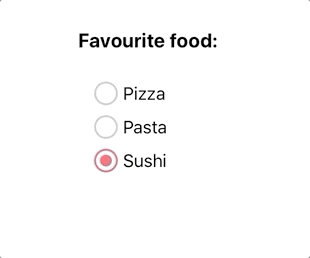

Simple radio buttons group

## Usage




```js 
import React from 'react';
import { LabeledRadioButtons } from 'nottinderuikit';

const SampleLabeledRadioButtons = () => {
  const options = [{ value: '1', label: 'Pizza' }, { value: '2', label: 'Pasta' }, { value: '3', label: 'Sushi' },];
  const handleChange = (option: { value: string, label: string }) => {
    console.log(option);
  }
  return <LabeledRadioButtons label='Favourite food:' options={options} onChange={handleChange} />
}

export default SampleLabeledRadioButtons
```

---

## Props

- [`label`](#label)
- [`options`](#options)
- [`onChange`](#onchange)
- [`defaultSelectedValue`](#defaultselectedvalue)

---
## Reference


### `label`

Label of the radio buttons group.

|  Type     | Default       | Required |
| :-------: | :-----------: | :------: |
| string    |   undefined   |  true    |

---
### `options`

Array of objects with the shape `{value:"", label:""}`, those objects will define the diferents radiobuttons.
The value is a non user visible string, and the label is shown on the right of the radiobutton

|  Type                                                  | Default       | Required |
| :----------------------------------------------------: | :-----------: | :------: |
| Array: {value:string, label:string}[]                  |   undefined   |  true    |

---
### `onChange`

Function executed when the selected radiobutton changes.

|  Type                                                     | Default     | Required |
| :-------------------------------------------------------: | :---------: | :------: |
| function: (option:{value:string, label:string}) => any     |  undefined  |  false   |

---
### `defaultSelectedValue`

Value of the option we want to select by default

|  Type      | Default         | Required |
| :--------: | :-------------: | :------: |
| string     |  undefined      |  false   |
